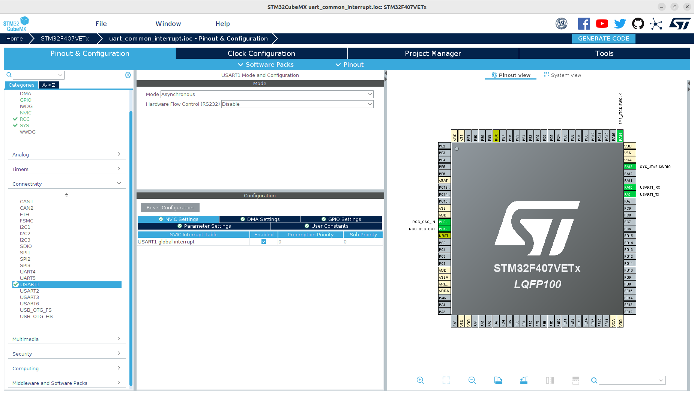

# 这是一个通过STM32CubeMX创建的串口中断工程
## 工程概述
+ 串口配置成普通模式，开启中断

## 1、创建过程
省略了基本配置，只展示串口中断相关配置

### 1.1、串口中断配置
+ 在Pinout&Configuration->Connectivity选择USART1，NVIC Setting->USART1 global interrupt->Enabled勾选

- 其它设置默认，一般不用修改

### 1.2、生成工程代码
- 点击GENERATE CODE，等待生成工程

## 2、代码分析
只分析串口中断相关部分
### 2.1、变量定义
```
...
/* USER CODE BEGIN PD */
#define RX_MAX_LENGTH (10)
/* USER CODE END PD */
...
/* USER CODE BEGIN PV */
uint8_t rx_buffer_;
uint8_t receive_buffer_[RX_MAX_LENGTH];
uint32_t rx_count_ = 0;
/* USER CODE END PV */
```
- RX_MAX_LENGTH：保存数据的buffer长度
- rx_buffer_：串口中断每次接收一位，保存在这个变量中
- receive_buffer_：多次中断接收的数据保存在这个数组中
- rx_count_：接收了多少位数据，注意，这个编译定义时，其类型要满足最大值RX_MAX_LENGTH，比如RX_MAX_LENGTH定义为500，则rx_count_不能是uint8_t类型，否则会溢出

### 2.2、使能串口中断
使用库函数HAL_UART_Receive_IT开启串口接收中断，每收到1位数据后，就触发一次中断，并把数据保存到变量rx_buffer_中
```
...
/* USER CODE BEGIN 2 */
  HAL_UART_Receive_IT(&huart1, (uint8_t *)&rx_buffer_, 1);
  /* USER CODE END 2 */
```

### 2.3、串口中断处理函数
```
...
/* USER CODE BEGIN PFP */
void UartHandle();
void ClearRxBuffer();
...
/* USER CODE BEGIN 4 */
void HAL_UART_RxCpltCallback(UART_HandleTypeDef *huart)
{
  /* Prevent unused argument(s) compilation warning */
  UNUSED(huart);
  /* NOTE: This function Should not be modified, when the callback is needed,
           the HAL_UART_TxCpltCallback could be implemented in the user file
*/
  if(huart->Instance == USART1)
  {
    UartHandle();
  }

}

void UartHandle() {
  if (rx_count_ >= RX_MAX_LENGTH) {
    uart_printf("rx buffer is full!\r\n");
    ClearRxBuffer();
  }

  receive_buffer_[rx_count_++] = rx_buffer_;

  uart_printf("receive data = %x\r\n", receive_buffer_[rx_count_ - 1]);

  HAL_UART_Receive_IT(&huart1, (uint8_t *)&rx_buffer_, 1);
}

void ClearRxBuffer()//清空接收缓存
{
  uint32_t i;
  for(i = 0; i < rx_count_; i++)
  {
    receive_buffer_[i] = 0;
  }
  rx_count_ = 0;
}
```

#### 2.3.1、HAL_UART_RxCpltCallback函数
- 该函数是HAL库的虚函数，可以被用户重写而覆盖
- 当发送串口中断时，会进入这个函数，在里面添加代码，根据Instance判断是哪个串口发生了中断，然后进入对应的中断处理函数

#### 2.3.2、UartHandle函数
这是一个自定义的中断处理函数
- 首先判断当前接收数据的buffer是否已经满了，如果满了，就清除（关于如何清除，可以有不同的处理方式，比如全部清除或清除最老的数据，其它移位，这里选择全部清除）
- 然后把中断数据写入buffer中
- 最后重新开启中断接收，准备接收下一位数据，退出中断服务程序

#### 2.3.3、ClearRxBuffer函数
该函数清空保存中断接收数据的buffer